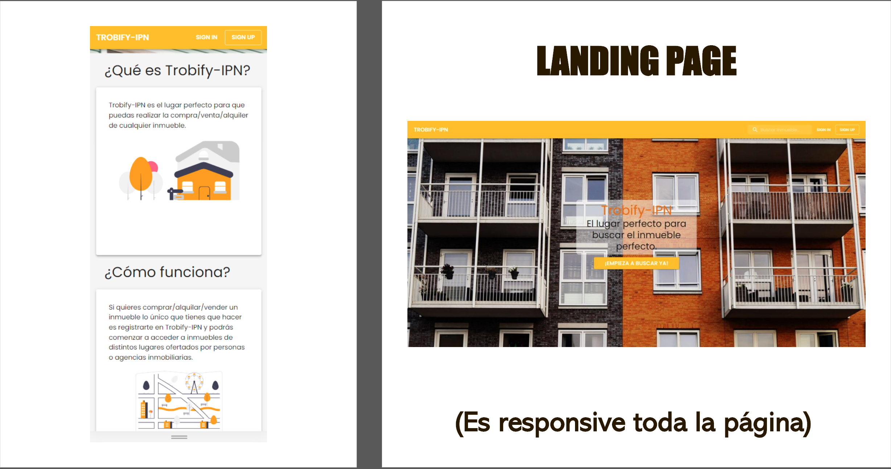
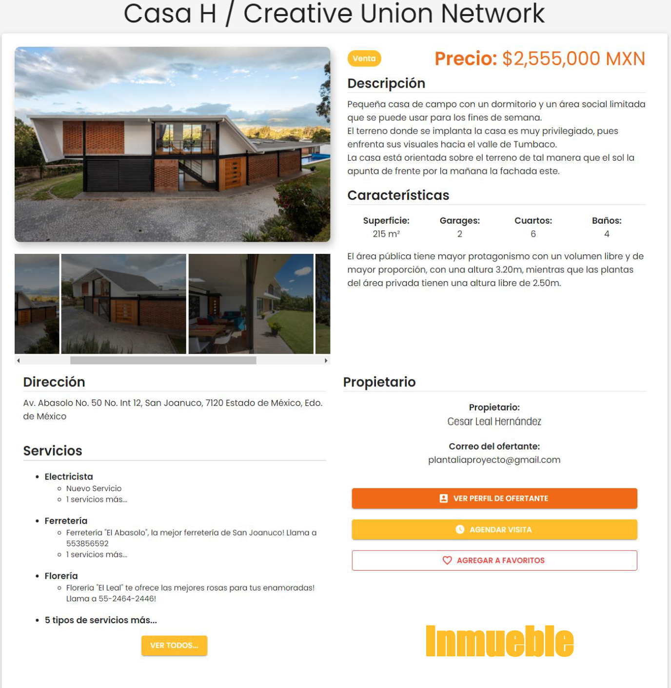
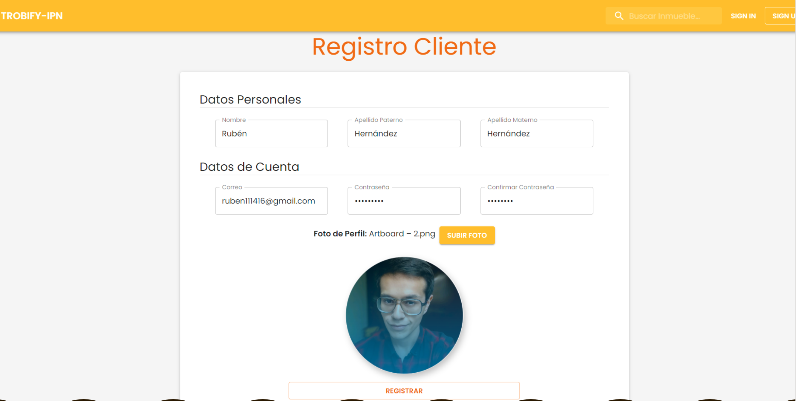

# TROBIFY-IPN

El proyecto contiene 3 ramas donde:
- **frontend**: Rama donde se trabajan los cambios en la parte web. Una vez validados por el equipo de frontend pueden pasar a la rama _integration_.
- **backend**: Rama donde se trabajan los cambios en la api, donde hasta ser validados por el equipo de backend pueden pasar a la rama _integration_.
- **integration**: Rama donde se encuentra la versión que se trabaje por sprint, una vez validada por todo el equipo (y preferentemente el Project Owner) pasará a la rama _main_.
- **main**: Rama donde se encuentra el código final de TROBIFY-IPN.

Para poder cambiar de rama a rama se usa el comando: `$ git checkout _rama_a_cambiar_`

Para poder pasar el contenido de una rama a otra se usa el comando: `$ git merge _rama_source` dentro de la rama que requiere el nuevo contenido.

Para poder enviar todos los cambios (commits y merge) usar el comando `$ git push --all -u`

Para pasar de la rama **integration** a **main** realizar un _pull request_.

# Web 📦

