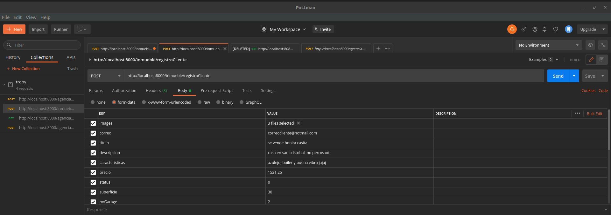

# EndPoints Inmuebles 📦
_documentacion para el funcionamiento de los endpoints correspondientes a la seccion de inmuebles_


# Seccion de listado y creacion 🔧

## '/inmueble/inmuebles' ⚙️
_* Peticion tipo GET_
_* No recibe parametros_


_Este endpoint tiene como finalidad traer la información de los inmuebles que se encuentran registrados en la base de datos._

_Si ocurre un error , obtenemos la respuesta :_

```
return res.status(500).json({
            ok:false,
            msg: 'error al cargar inmuebles'
        })
```

_si todo sale correcto , se responde con un JSON  el cual contiene un array de objetos con todos los datos relacionados con los inmuebles_

```
[
    {
        "titulo": "titulo prueba",
        "descripcion": "des prueba",
        "caracteristicas": "carac prueba",
        "precio": 567654,
        "status": 1,
        "superficie": 456,
        "nGarage": 0,
        "nRecamaras": 4,
        "nBanios": 2,
        "propietario": "Ehecatzin",
        "idinmueble": "inmueble1",
        "transaccion": "renta",
        "calle": "calle prueba",
        "numExt": 17,
        "numInt": 17,
        "colonia": "Col prueba",
        "ciudad": "cd prueba",
        "estado": "e prueba",
        "cp": 9440,
        "imgs": [],
        "servicios": [
            {
                "servicio": "walmart",
                "descripcion": "servicio de prueba"
            },
            {
                "servicio": "comercial",
                "descripcion": "descripcion prueba"
            }
        ]
    }
]
```


# variantes 🔧

## '/inmueble/inmueblesCliente/:correo' ⚙️
_* Peticion GET_
_* Parametro a recibir : correo del cliente_

_Esta variante recibe como parametro el correo del clientey muestra la informacion de todos los inmuebles relacionados a el. La respuesta es la misma que la propuesta en  el endpoint principal '/inmueble/inmuebles'_

## '/inmueblesAgencia/:correo' ⚙️
_* peticion GET_
_* parametro a recibir : correo de la agencia_


_Esta variante recibe como parametro el correo de la agencia y muestra la informacion de todos los inmuebles relacionados a dicha agencia. La respuesta es la misma que la propuesta en el endpoint principal '/inmueble/inmuebles'_


# Manejo de favoritos ❣❣

## '/agregarFavorito' ⚙️
_* Peticion POST_
_* Parametro a recibir: idinmueble_
_Valida el JSON WEB TOKEN para verificar que exista una autenticacion valida por parte de algun usario para poder realizar la accion_

_Datos necesarios para pruebas:_

```
En header:  KEY : "token"  , VALUE : TOKEN (Generado por incio de sesion o registro)
```

```
BODY : JSON {"idinmueble":"un id de algun inmueble" }

```
# Respuestas 📢
_Si todo sale correcto :_

```
{
    "ok": true,
    "msg": "Agregado Correctamente"
}
```

_Si ocurre algun error :_

```
{
    "ok": false,
    "msg": "Ocurrio un error"
}
```

## '/eliminarFavorito' ⚙️

_* Peticion POST_
_* Parametro a recibir: idinmueble_
_Valida el JSON WEB TOKEN para verificar que exista una autenticacion valida por parte de algun usario para poder realizar la accion_

_Este endpoint se encarga de eliminar un favorito y mandarlo a la papelera de favoritos_

_Datos necesarios para pruebas:_

```
En header:  KEY : "token"  , VALUE : TOKEN (Generado por incio de sesion o registro)
```

```
BODY : JSON {"idinmueble":"un id de algun inmueble" }

```

# Respuestas 📢
_Si todo sale correcto :_

```
{
    "ok": true,
    "msg": "Eliminado Correctamente"
}
```

_Si ocurre algun error :_

```
{
    "ok": false,
    "msg": "Ocurrio un error"
}

```

# Servicios 🏢

## 'inmueble/registrarServicio' ®
_Este endpoint se encarga de listar y registrar nuevos servicios por zona_
_* Peticion Post_
_* Body esperado :_
```
{
    "servicio":"ferreteria",
    "descripcion":"la mejor purificadora de lo mejor en servicios",
    "zona":"09440"
}
```
_Servcio : representa uno de los tipos de servicio seleccionados del catalogo, descripcion: descripcion del servicio. Zona:la zona en la que se va a registrar el nuevo servicio_

# Respuestas 📢

_Si todo sale correcto (devuelve un JSON):_
```
{
    "ok": true,
    "msg": "¡Servicio registrado exitosamente!"
}
```

_Si ocurre algun error (devuelve un JSON) :_
```
{
    "ok": false,
    "msg": "Matenga la calma y comuniquese con su programador backend mas cercano"
}
```

# Ejemplo de Prueba


## 'inmueble/mostrarServicios/:cp' 👀

_Este endpoint se encarga de listar todo acerca de los servicios_
_* Peticion GET_
_* argumento esperado : codigo postal_

# Respuestas 📢
_Si todo sale correcto (devuelve un JSON) con ub boolean y una lista de json's  con la informacion del servicio:_

```
{
    "ok": true,
    "servicios": [
        {
            "servicio": "comercial",
            "descripcion": "descripcion prueba"
        },
        {
            "servicio": "ferreteria",
            "descripcion": "la mejor purificadora de lo mejor en servicios"
        }
    ]
}
```

_Si ocurre algun error (devuelve un JSON) :_

```
{
    ok:false,
    msg:"Matenga la calma y comuniquese con su programador backend mas cercano"

}

```

# Ejemplo de Prueba


## 'inmueble/registroCliente' ®
_Este endpoint registra un inmueble de parte del cliente_
_* Peticion Post_
_* Body esperado :_
```
El body a utilizar puede ser de tipo JSON y con los siguientes datos como ejemplo
{
    "correo":"correocliente@hotmail.com",
    "titulo":"se vende bonita casa",
    "descripcion":"casa en san cristobal no perros",
    "caracteristicas":"azulejo,boiler y buena vibra xd",
    "precio":"1521.5",
    "status":"0",
    "superficie":"30",
    "noGarage":"2",
    "noRecamaras":"3",
    "noBanios":"1",
    "propietario":"San martin chanclas",
    "transaccion":"venta",
    "cp":"54180",
    "calle":"Tlatelolco",
    "noExterior":"17",
    "noInterior":"2",
    "colonia":"San Juan",
    "ciudad":"Tlane",
    "estado":"Edomex"
}
Además, puede recibir multiples imagenes con el nombre "images", que serán las imagenes del inmueble

```

# Respuestas 📢
_Si el cliente que esta registrando el inmueble, por alguna razón no esta en la base de datos (devuelve un JSON):_
```
{
    "mensaje": "Cliente no encontrado en la BD"
}
```
_Si todo sale correcto (devuelve un JSON):_
```
{
    "mensaje": "Inmueble registrado con exito al cliente"
}
```

_Si ocurre algun error (devuelve un JSON) :_
```
{
   
    "mensaje": "No se completo la petición"
}
```

# Capturas de Pruebas


## 'inmueble/registroAgencia' ®
_Este endpoint registra un inmueble de parte de la Agencia_
_* Peticion Post_
_* Body esperado :_
```
El body a utilizar puede ser de tipo JSON y con los siguientes datos como ejemplo
{
    "correo":"correoagencia@hotmail.com",
    "titulo":"se vende bonita casa",
    "descripcion":"casa en san cristobal no perros",
    "caracteristicas":"azulejo,boiler y buena vibra xd",
    "precio":"1521.5",
    "status":"0",
    "superficie":"30",
    "noGarage":"2",
    "noRecamaras":"3",
    "noBanios":"1",
    "propietario":"San martin chanclas",
    "transaccion":"venta",
    "cp":"54180",
    "calle":"Tlatelolco",
    "noExterior":"17",
    "noInterior":"2",
    "colonia":"San Juan",
    "ciudad":"Tlane",
    "estado":"Edomex"
}
Además, puede recibir multiples imagenes con el nombre "images", que serán las imagenes del inmueble

```

# Respuestas 📢
_Si el cliente que esta registrando el inmueble, por alguna razón no esta en la base de datos (devuelve un JSON):_
```
{
    "mensaje": "Agencia no encontrada en la BD"
}
```
_Si todo sale correcto (devuelve un JSON):_
```
{
    "mensaje": "Inmueble registrado con exito a la agencia"
}
```

_Si ocurre algun error (devuelve un JSON) :_
```
{
   
    "mensaje": "No se completo la petición"
}
```


## Autores ✒️
* **Ehecatzin Vallejo** - *Endpoints Inmueble* - [catzin](https://github.com/catzin)
