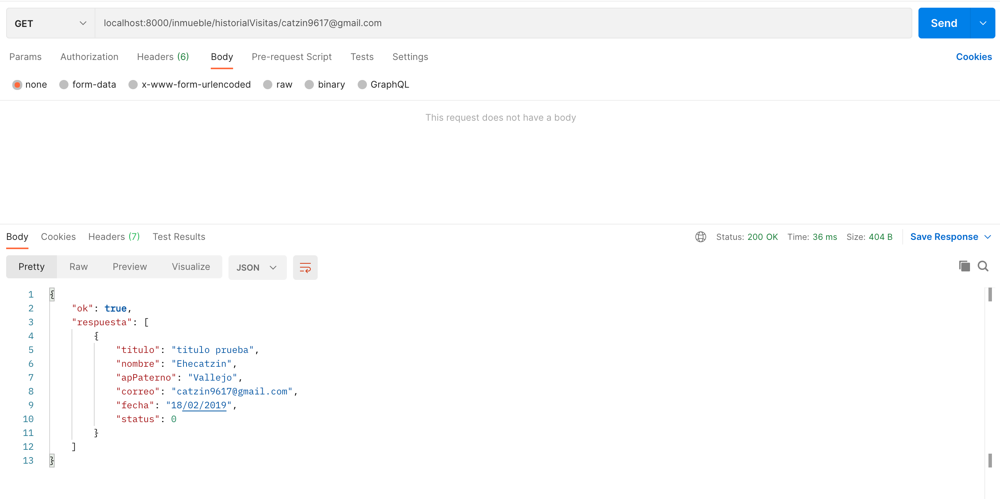

# EndPoints Agencia 📦
_Documentacion para el funcionamiento de las endpoints correspondientes a la seccion de visita (agencia -> inmueble <- cliente)


# Seccion de listado y creacion 🔧

## 'Servidor local:' ⚙️
_http://localhost:8000_

## '/agencia/registrar' ⚙️
_* Peticion tipo **POST**_
_* Recibe un body (JSON) {"atributo":"ejemplo"}, con los siguientes atributos (con ejemplo):_
```
{
    "cliente_correo": "david.mb5@hotmail.com",
    "inmueble_id": "inmueble3r0yx087xokpa7hnvb",
    "fecha_visita": "2021-05-29 18:00:00"
}
```

_Tiene como funcionalidad registrar una visita de inmueble en la plataforma._

_Si ocurre un error, obtenemos la respuesta:_

```
return res.status(500).json({
            ok: false,
            msg: 'No se pudo registrar la petición de visita'
        })
```

_Si todo sale correcto, obtenemos la respuesta:_
```
return res.status(200).json({
            ok: true,
            msg: 'Petición de visita agendada'
        })
```

# EndPoint Historial-Visita
## 'localhost:8000/inmueble/historialVisitas/:correo' ⚙️
_* Peticion tipo **POST**_
_* Recibe un correo(ya sea de cliente o agencia)_


_Si todo sale correcto, obtenemos la respuesta(en base al tipo de cliente detectado):_
_JSON con la informacion referente a la visita (titulo es el titulo del inmueble) , como lo son los datos del cliente que realizo la visita a cierto inmueble_ 
```
{
    "ok": true,
    "respuesta": [
        {
            "titulo": "titulo prueba",
            "nombre": "Ehecatzin",
            "apPaterno": "Vallejo",
            "correo": "catzin9617@gmail.com",
            "fecha": "18/02/2019",
            "status": 0
        }
    ]
}
```

_Si no se encuentra respuesta_

```
{
    "ok": true,
    "msg": 'No hay visitas aún'
      
}
```

# Ejemplo de funcionamiento


